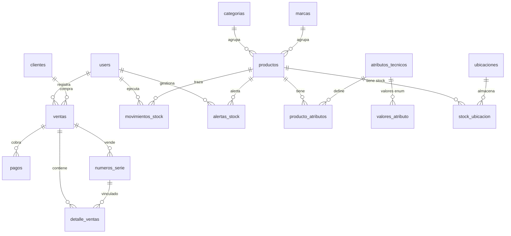

# 03 — Base de Datos

Diseño del schema, relaciones y seeders.

---

## 📊 Visión general

| Concepto | Valor |
|---|---|
| Motor | PostgreSQL 18.6 |
| Codificación | UTF8 |
| Collation | en_US.UTF-8 (o es_BO.UTF-8) |
| Total de tablas | 44 |
| Tipos ENUM | 20 |
| Índices de búsqueda | 20+ |
| Extensiones | `pg_trgm`, `unaccent` |

**Fuente de verdad**: `database/schema/pgsql-schema.sql`

Este archivo se carga automáticamente con `php artisan migrate:fresh` (gracias al schema dump de Laravel 11+).

---

## 🗂️ Grupos de tablas

### 1. Usuarios y roles (5 tablas)

| Tabla | Propósito |
|---|---|
| `users` | Usuarios del sistema (con `activo`, `telefono`, `nit_ci`, `pref_*`) |
| `roles` | 5 roles: Admin, Vendedor, Cajero, Inventario, Cliente |
| `permissions` | ~60 permisos organizados por módulo |
| `model_has_roles` | Pivote usuario↔rol |
| `model_has_permissions` | Pivote usuario↔permiso (casos especiales) |
| `role_has_permissions` | Pivote rol↔permiso |

### 2. Catálogo (6 tablas)

| Tabla | Propósito |
|---|---|
| `clientes` | Clientes con NIT/CI y datos fiscales |
| `categorias` | Procesadores, RAM, Laptops, etc. |
| `marcas` | Intel, AMD, ASUS, HP, Dell, etc. |
| `productos` | Catálogo con SKU, precios, stock y umbral |
| `atributos_tecnicos` | Catálogo de atributos (socket, tipo_ram, vatios...) |
| `valores_atributo` | Valores enum predefinidos (AM4, DDR5, LGA1700...) |
| `producto_atributos` | **EAV**: valores concretos por producto |

### 3. Inventario (5 tablas)

| Tabla | Propósito |
|---|---|
| `ubicaciones` | Tienda, Depósito + subdivisiones (pasillo/estante/anaquel) |
| `stock_ubicacion` | Stock por producto por ubicación (fuente de verdad) |
| `movimientos_stock` | Trazabilidad completa con `stock_resultante` |
| `alertas_stock` | Alertas de bajo stock y sin stock |
| `importaciones` | Historial de cargas CSV |

### 4. Ventas y operaciones (8 tablas)

| Tabla | Propósito |
|---|---|
| `ventas` | Cabecera de ventas (POS) |
| `detalle_ventas` | Items vendidos (con precio congelado) |
| `pagos` | Pagos individuales (pago mixto soportado) |
| `cotizaciones` | Cotizaciones con validez |
| `cotizacion_items` | Items de cotización |
| `numeros_serie` | Unidades individuales con trazabilidad |
| `devoluciones` | Devoluciones y garantías |
| `cierres_caja` | Cierre de caja diario |

### 5. Compras (3 tablas)

| Tabla | Propósito |
|---|---|
| `proveedores` | Proveedores con condiciones comerciales |
| `ordenes_compra` | Órdenes formales con PDF |
| `orden_compra_items` | Items de la orden |

### 6. Catálogo público (2 tablas)

| Tabla | Propósito |
|---|---|
| `pedidos` | Pedidos del catálogo online |
| `pedido_items` | Items del pedido |

### 7. Fidelización y extras (6 tablas)

| Tabla | Propósito |
|---|---|
| `puntos` | Movimientos de puntos |
| `respaldos` | Historial de backups |
| `facturas_electronicas` | Facturas con CUF/CUFD |
| `logs_auditoria` | Auditoría de accesos y cambios |
| `compatibilidad_reglas` | Reglas del motor de compatibilidad |
| `encuestas_catalogo` | Encuestas anónimas del catálogo |

### 8. Internas de Laravel (7 tablas)

| Tabla | Propósito |
|---|---|
| `migrations` | Control de migraciones |
| `password_reset_tokens` | Reset de contraseña |
| `sessions` | Sesiones de usuario |
| `cache`, `cache_locks` | Cache |
| `jobs`, `job_batches`, `failed_jobs` | Colas |

---

## 🔗 Relaciones principales



---

## 🎨 El modelo EAV (Entity-Attribute-Value)

### ¿Por qué EAV?

Cada categoría tiene **atributos técnicos distintos**:

| Categoría | Atributos específicos |
|---|---|
| Procesadores | socket, núcleos, hilos, frecuencia, TDP |
| Memorias RAM | tipo_ram, capacidad, frecuencia |
| Tarjetas madre | socket, chipset, tipo_ram |
| Tarjetas gráficas | chipset, VRAM, longitud |
| Fuentes | vatios, certificación |
| Laptops | pantalla, procesador, RAM, SO |

**Un modelo rígido de columnas fijas no escala**. Con EAV, agregar un atributo nuevo no requiere migración.

### Tablas EAV

#### `atributos_tecnicos` (definición)

```sql
CREATE TABLE atributos_tecnicos (
    id              BIGSERIAL PRIMARY KEY,
    nombre          VARCHAR(255) UNIQUE,           -- "socket", "tipo_ram"
    tipo_dato       enum_atributo_tipo_dato,       -- string|integer|decimal|boolean|enum
    unidad          VARCHAR(20),                    -- "GHz", "GB", "W"
    categoria_id    BIGINT NULL,                   -- NULL = aplica a todas
    es_filtrable    BOOLEAN DEFAULT TRUE,
    es_comparable   BOOLEAN DEFAULT TRUE,
    orden           INTEGER DEFAULT 0
);
```

#### `valores_atributo` (valores enum predefinidos)

```sql
CREATE TABLE valores_atributo (
    id            BIGSERIAL PRIMARY KEY,
    atributo_id   BIGINT,                          -- FK a atributos_tecnicos
    valor         VARCHAR(255),                    -- "AM4", "LGA1700"
    orden         INTEGER DEFAULT 0
);
```

#### `producto_atributos` (valor concreto por producto)

```sql
CREATE TABLE producto_atributos (
    id              BIGSERIAL PRIMARY KEY,
    producto_id     BIGINT,
    atributo_id     BIGINT,
    valor_string    VARCHAR(255) NULL,             -- para tipo string
    valor_integer   INTEGER NULL,                  -- para tipo integer
    valor_decimal   DECIMAL(12,4) NULL,            -- para tipo decimal
    valor_boolean   BOOLEAN NULL,                  -- para tipo boolean
    valor_enum_id   BIGINT NULL,                   -- para tipo enum
    UNIQUE (producto_id, atributo_id)              -- 1 valor por atributo
);
```

### Ejemplo real

**Producto**: AMD Ryzen 5 5600X

| atributo_id | nombre | tipo_dato | valor almacenado |
|:-:|---|---|---|
| 1 | socket | enum | `valor_enum_id = 1` → "AM4" |
| 2 | núcleos | integer | `valor_integer = 6` |
| 3 | hilos | integer | `valor_integer = 12` |
| 4 | frecuencia | decimal | `valor_decimal = 3.7000` |
| 5 | TDP | integer | `valor_integer = 65` |

---

## 📦 Seeders (datos maestros)

Todos los seeders usan `updateOrCreate()` o `firstOrCreate()` — son **idempotentes** (se pueden correr N veces sin duplicar).

| Seeder | Registros | Propósito |
|---|:-:|---|
| `RoleSeeder` | 5 roles + ~60 permisos + 4 usuarios demo | Base del sistema de permisos |
| `CategoriaSeeder` | 11 categorías | Estructura del catálogo |
| `MarcaSeeder` | 19 marcas | Intel, AMD, NVIDIA, ASUS, HP, Dell, etc. |
| `AtributoTecnicoSeeder` | 21 atributos | socket, tipo_ram, vatios, frecuencia... |
| `ValorAtributoSeeder` | 21 valores | AM4, AM5, LGA1700, DDR4, DDR5... |
| `UbicacionSeeder` | 7 subdivisiones | Tienda · Pasillo A · Estante 1/2, etc. |
| `DemoProductoSeeder` | 15 productos | Ryzen, Intel, ASUS, HP, Lenovo... |

### Ejecutar seeders

```bash
# Todos los seeders (recomendado)
php artisan migrate:fresh --seed

# Solo un seeder específico
php artisan db:seed --class=CategoriaSeeder

# Resetear la BD completa
php artisan migrate:fresh --seed
```

---

## 🗄️ Datos maestros vs datos reales

| Tipo | Ejemplos | ¿Va al repo? | Cómo se comparte |
|---|---|:-:|---|
| **Datos maestros** | Categorías, marcas, atributos, valores, ubicaciones, roles | ✅ Sí | Seeders |
| **Datos reales** | Productos reales, clientes, ventas, movimientos | ❌ No | Dump de BD o UI |

Ver el [README principal](../README.md) para más detalles sobre el flujo de datos.

---

## 🔍 Búsqueda fuzzy

El schema incluye extensión `pg_trgm` con índices GIN:

```sql
CREATE EXTENSION IF NOT EXISTS pg_trgm;
CREATE INDEX productos_nombre_trgm_idx ON productos USING GIN (nombre gin_trgm_ops);
CREATE INDEX productos_sku_trgm_idx    ON productos USING GIN (sku gin_trgm_ops);
CREATE INDEX productos_desc_trgm_idx   ON productos USING GIN (descripcion gin_trgm_ops);
```

Esto permite búsquedas tolerantes a errores tipográficos:

```php
Producto::whereRaw("nombre % ?", ['rayzen'])->get();
// Encuentra "Ryzen" aunque esté mal escrito
```

---

## 🛡️ Reglas de integridad

| Regla | Dónde se aplica |
|---|---|
| Stock nunca negativo | `CHECK (stock >= 0)` en `productos` y `stock_ubicacion` |
| Umbral de alerta ≥ 0 | `CHECK (umbral_alerta >= 0)` |
| Email único | `UNIQUE (email)` en `users` |
| SKU único | `UNIQUE (sku)` en `productos` |
| Un cierre por vendedor/día | `UNIQUE (user_id, fecha_cierre)` en `cierres_caja` |
| Un valor por atributo por producto | `UNIQUE (producto_id, atributo_id)` |
| Invariante de stock | Garantizado por `InventoryService` |

### Políticas ON DELETE

| FK | Regla | Razón |
|---|:-:|---|
| `productos.categoria_id` | RESTRICT | No eliminar categoría con productos |
| `productos.marca_id` | SET NULL | La marca puede desaparecer |
| `detalle_ventas.producto_id` | RESTRICT | No eliminar producto con ventas |
| `movimientos_stock.producto_id` | CASCADE | El historial se va con el producto |
| `puntos.cliente_id` | CASCADE | Los puntos dependen del cliente |

---

## 🎯 Convenciones

- **Nombres de tablas**: plural en español (`productos`, `categorias`, `ventas`)
- **Nombres de columnas**: singular en snake_case (`precio_unitario`, `nit_ci`)
- **FKs**: `<tabla_singular>_id` (`categoria_id`, `producto_id`)
- **Timestamps**: `created_at`, `updated_at` en todas las tablas
- **Soft deletes**: solo en `users` (campo `activo`)

---

## ➡️ Siguiente paso

- [04 — Roles y permisos](04-roles-permisos.md) para ver la matriz de permisos
- [05 — Sprint 1](05-sprint-01.md) para ver qué se implementó
