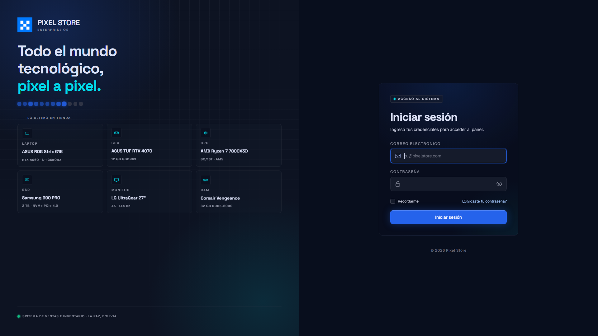
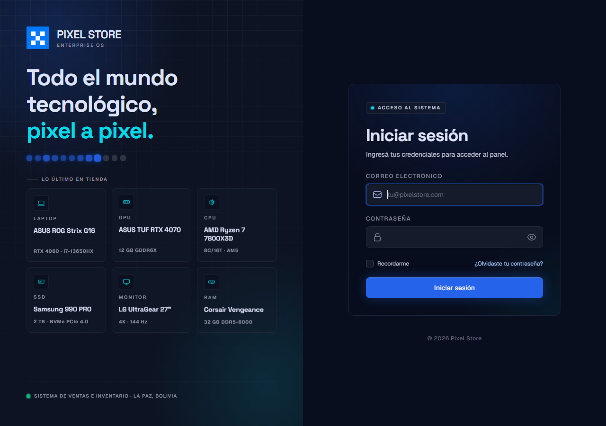
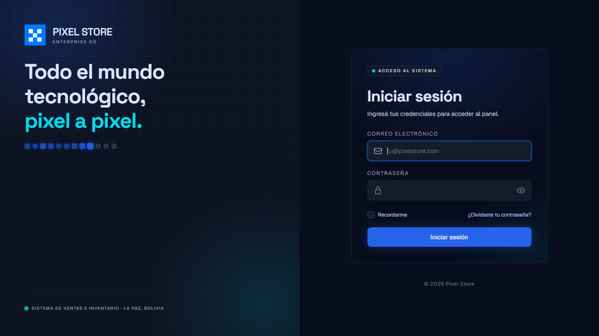
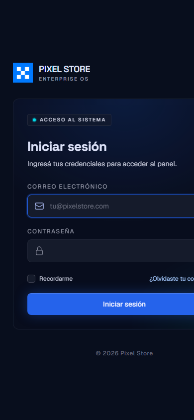

# Entrega — Etapa 1: sistema Obsidian + login rediseñado

**Fecha**: 2026-10-09
**Estado**: ✅ Entregado — pendiente de aprobación
**Commits**: `4dbcc60` → `91bf51d` → `5827ac5` (+ cierre `2ecdc43`)

---

## Resumen

El login de Pixel Store quedó rediseñado con el sistema visual **Obsidian Cyber
Grid** (propuesta entregada por el cliente) e incorpora una galería de 6
productos dentro del panel de marca. **No se tocó el panel administrativo**:
queda para la Etapa 2.

**146 tests verdes · 0 regresiones.**

---

## Qué cambió

### 1. Login rediseñado (sistema Obsidian)

- Split de 2 columnas: marca a la izquierda, formulario a la derecha
  (`lg:grid lg:grid-cols-2`); en mobile colapsa a una sola columna.
- Paleta Obsidian: canvas `#0d1322` (`surface`) y CTA azul `#2563eb`
  (`primary-container`).
- Tipografías cargadas desde `fonts.bunny.net`: **Space Grotesk** (títulos),
  **Geist** (cuerpo) y **JetBrains Mono** (labels).
- Radios `obsidian` / `obsidian-lg` / `obsidian-xl` (4/8/12 px), aditivos en
  `tailwind.config.js`.
- Card del formulario con **glassmorphism** (spotlight que sigue el mouse).
- Microinteracciones: entrada escalonada por bloques, toggle de visibilidad de
  contraseña (Alpine, con `aria-label` dinámico) y **loading state real**
  (spinner + «Verificando…», botón deshabilitado). El submit sigue siendo el de
  Laravel.

### 2. Galería de componentes (dentro del panel de marca)

6 productos con specs reales:

| Categoría | Producto | Spec |
|---|---|---|
| Laptop | ASUS ROG Strix G16 | RTX 4060 · i7-13650HX |
| GPU | ASUS TUF RTX 4070 | 12 GB GDDR6X |
| CPU | AMD Ryzen 7 7800X3D | 8C/16T · AM5 |
| SSD | Samsung 990 PRO | 2 TB · NVMe PCIe 4.0 |
| Monitor | LG UltraGear 27" | 4K · 144 Hz |
| RAM | Corsair Vengeance | 32 GB DDR5-6000 |

- Iconos SVG dibujados a medida (laptop, GPU, CPU, SSD, monitor, RAM).
- **Guard de altura medido**: visible solo desde `min-width: 1280px` **y**
  `min-height: 800px`. A 1280 de ancho el aside necesita ~800 px de alto; con
  menos, el contenido desborda. En `lg` (1024–1279) queda oculta.
- Animaciones: entrada escalonada, `tile-float` sutil (5 s) y hover lift.
- Todas las animaciones decorativas respetan `prefers-reduced-motion: reduce`.
- **Datos hardcodeados** en un array `@php` — moverlos a BD es Etapa 3.

### 3. Fundamentos del sistema Obsidian

- Tokens documentados y reconciliados en `docs/design/obsidian-cyber-grid.md`
  (fuente de verdad).
- `tailwind.config.js` extendido de forma **aditiva**: los tokens Obsidian
  conviven con `slate`/`blue` sin romper nada.

---

## Qué NO cambió

- **Panel admin, dashboard y vistas de gestión** → siguen en `slate`/`blue`
  (Etapa 2).
- **Controladores, políticas, rutas y formularios** → intactos.
- **Lógica de throttling de login** → sigue la de Breeze
  (`LoginRequest`: 5 intentos / 60 s por `email+IP`).
- Funcionalidad → 100 % preservada.

> **Nota de cierre**: se eliminó un rate limiter `login` sin uso en
> `AppServiceProvider` (ninguna ruta aplicaba `throttle:login`). No altera
> comportamiento; ver commit `2ecdc43`.

---

## Verificación

- ✅ **146 tests passing (543 assertions)**, 0 regresiones
- ✅ Login funcional: redirige a `/dashboard`
  (`test_login_exitoso_redirige_al_dashboard`)
- ✅ `npm run build` OK — ambas paletas compilan (tokens viejos y nuevos)
- ✅ Screenshots en múltiples breakpoints (ver `screenshots/`)
- ⚠️ Revisión de consola del navegador: **no re-verificada** en este cierre (no
  hubo cambios de código de frontend desde que se tomaron las capturas)

---

## Screenshots

Todas en `docs/rediseno/screenshots/`.

### Login en 1920×1080 (con galería completa)



### Login en 1280 (breakpoint ajustado)



### Login en laptop 1366×768 (galería oculta por altura)



### Login en mobile 390



### Verificación de movimiento reducido


Capturas adicionales de breakpoints intermedios:
`login-check-1024x768.png`, `login-check-1280x800.png`.

---

## Preguntas para el cliente

1. **«Enterprise OS»** — aparece como eyebrow bajo el wordmark «PIXEL STORE».
   ¿Es correcto o lo cambiamos?
2. **Datos de la galería** — son 6 productos demo (ASUS ROG, RTX 4070, etc.).
   ¿Son los que querés mostrar o preferís otros?
3. **Mockup / `DESIGN.md` completo** — si tenés el archivo original con más
   pantallas (register, dashboard, catálogo), compartilo así alineamos la
   Etapa 2 antes de empezar.
4. **Catálogo público** — ¿tenés pantallas pensadas? (es Etapa 3 en el plan)

---

## Próximos pasos (pendientes de aprobación)

- **Etapa 2** — migrar panel admin + componentes base al sistema Obsidian
  (~15–20 h).
- **Etapa 3** — catálogo público.
- **Deuda menor** — falta logo para fondos oscuros
  (`TECH_DEBT.md` → `pixel-logo-white.png`).

---

## Cómo ver el login

```bash
php artisan serve
# Ir a http://127.0.0.1:8000/login
```
